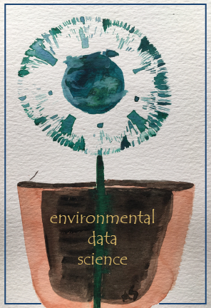

# R Markdown and Bookdown

This book is built using R Markdown and bookdown methods, and published at http://bookdown.org. There are some more comprehensive resources on both of these at @RMarkdown and @Bookdown, and also the markdown cheat sheet at https://www.rstudio.com/wp-content/uploads/2015/02/rmarkdown-cheatsheet.pdf but I thought it might be useful to provide some things I've discovered. 

- The first section is about R Markdown, and has the basics for creating a report with Markdown text and code outputs. To keep it simple, you might just go with html output. 
- Next is a template that provides the basic settings that should work to create a report in either HTML, pdf, or Word formats, using the `tinytex` LaTeX interpreter you'll need to install if you want to create pdf output.
- The next section is more on bookdown extensions to R markdown, including how to build a book with chapters with a referencing system for figures with headings and text citations, indices, and other features.  
- The pdf section describes more about the process for creating pdf via a LaTeX interpreter, with advanced stuff needed for controlling the format, especially if you want to go to a publisher who'll have very specific rules to follow. 

## R Markdown

Markdown isn't new and isn't at all restricted to R. It's the basis for Jupyter Notebooks, which I tend to use for Python but also works with R (the "py" in Jupyter is for Python and the "r" is for R); but I think R Markdown is better developed within RStudio, which provides more of an all-in-one *integrated development environment* (IDE). 

For most users, what's covered in the cheat sheet, which should be at  https://www.rstudio.com/wp-content/uploads/2015/02/rmarkdown-cheatsheet.pdf is all you need to be able to format nice R Markdown documents, but the more thorough treatment at @RMarkdown is a good resource for going further.

### Markdown editing
The most basic thing to understand is that an R Markdown `.Rmd` document is divided into three elements:

- Optional header information at the top, marked off by `---` in the first line, followed by any YAML settings you want to set, and closing with another line of `---`.
- Markdown sections not delimited by anything, but responding to markdown formatting like pairs of `*` enclosing *text in italics*, pairs of `**` enclosing **bold text**, pairs of backticks enclosing `bits of code`, and lots of other things. Section headers are created with one or more hash `#` characters at the start of a line followed by the header text on that line, and when editing will show up as blue text like the italic and bold text; the top level has a single `#`, the next has `##` (like this **R Markdown** section), and so on. You can create bulleted lists with each item starting with a dash `-` after a blank line to get it started (see below), and lots of other things -- see @RMarkdown and other sources for the multitude of formatting structures that markdown provides. Here's some of the text shown above as you enter it as markdown, though RStudio will wrap the long lines of text, and also provide color coding:

````{verbatim}
### Markdown editing
The most basic thing to understand is that an R Markdown `.Rmd` document is divided into three elements:

- Optional header information at the top, marked off by `---` in the first line, followed by any YAML settings you want to set, and closing with another line of `---`.
- Markdown sections not delimited by anything, but responding to markdown formatting like pairs of `*` enclosing *text in italics*, pairs of `**` enclosing **bold text**, pairs of backticks enclosing `bits of code`, and lots of other things. Section headers are created with a hash `#` character in the first
````

- Code chunks delimited by triple backticks, the first followed on its line with the code chunk header with `{r ...}` identifying R as the language along with other settings. A code chunk typically produces just one output (or maybe none at all, if it's just processing data you might use later). Here's a simple example, with one code chunk label and one setting, then code that creates and then displays a vector:

````{verbatim}
```{r chunklabel, include=FALSE}
a <- c(1, 7, 5)
a
```
````
```{r chunklabel, echo=FALSE}
a <- c(1, 7, 5)
a
```

### Display options in code chunks

The display options for code chunk headers `{r ...}` are very important to figure out in order to avoid unwanted messages in the rmarkdown document or book, and get figure headings working.  Each option is separated by a comma, and follow the code chunk label. See https://www.rstudio.com/wp-content/uploads/2015/02/rmarkdown-cheatsheet.pdf for a list of these options. I've found that some of what's documented at https://yihui.org/knitr/options/#code-evaluation doesn't work for me, so here's what I've observed: `echo=TRUE` won't display the code if `include=FALSE` is set, though the above source suggests that the `include` option only refers to chunk output.

Display options:

1. no code no outputs  : `include=F` [normal for exercises in book]
2. code no outputs     : `include=T,fig.show="hide",results=F` (`include=T` is default) `results="markup"` is default (same as `TRUE`?)
3. code and outputs    : `include=T,echo=T,fig.show=T,results=T`  (return to defaults)
4. no code or no eval  : `include=F,eval=F`

And there are lots of other code options, like including a numbered figure caption with `fig.cap="my figure caption"`.  The bookdown output extensions add citing and linking to the figure in the text, using the referencing system.

**Warnings and messages**
Turning off warnings and messages is so important in a book that I use `knitr::opts_chunk$set` to set these as defaults at the top of each chapter .Rmd. 

````{verbatim}
```{r echo=F}
knitr::opts_chunk$set(echo=T, warning=F, message=F, fig.align='center', out.width="75%")
```
````

However some things that seem like messages are actually *results*, for instance:

`st_read` will create unwanted messages that are actually results, so you can either put it in a code chunk that isn't displayed at all with `include=F` or probably better use `results = "hide"`. For instance, the following code is in a code chunk that has three options `{r warning=F, results="hide", message=F}` to avoid printing quite a lot of unwanted stuff.   

````{verbatim}
```{r warning=F, results="hide", message=F}
library(sf); library(igisci)
places <- st_read(ex("sierra/CA_places.shp"))
```
````
>You could of course have used that `knitr::opts_chunk$set` at the top of your code to avoid the warnings and messages, but you often want to see *results*, so hiding them is best isolated in a code chunk that isn't producing any results you want to see, and this is typically things like `st_read` I've found. 

>Also, avoid setting results="hide" in a `knitr::opts_chunk$set` since it also has an impact on knitr operations like adding images. But if you want to do this for a section of the book, remember to set it back to the default `results = T`.

### Numbered figures with text citations

Most of the your figures are going to be created by code in an individual code chunk, and it's a good idea to create a figure heading. You should organize your code chunk so that it only produces one figure, so you can use the code chunk header to provide the figure heading, and be able to cite the figure in text just before. *Note that the referencing capability requires bookdown output extensions to R Markdown, described below.*

To do this, once you've created a code chunk with an informative but unique chunk label (chunk labels cannot be reused in the document) like "visGraph", and also provide a figure caption with `fig.cap="..."` in the code chunk header, then in the text just above, you can use the referencing function `\@ref()` to cite the figure using the `fig:` key followed by the chunk label, either including parentheses or not:

- `Figure \@ref(fig:visGraph)` which produces this citation: Figure \@ref(fig:visGraph), or
- `(Figure \@ref(fig:visGraph))` which produces this citation: (Figure \@ref(fig:visGraph)). 

Here's what the code chunk and figure would then look like:

````{verbatim}
```{r visGraph, fig.cap="Vegetation bar graph"}
library(ggplot2); library(igisci)
ggplot(XSptsNDVI, aes(vegetation)) + 
  geom_bar()
```
````
```{r visGraph, fig.cap="Vegetation bar graph", echo=F}
library(ggplot2); library(igisci)
ggplot(XSptsNDVI, aes(vegetation)) + 
  geom_bar()
```

Or you may want to create a figure from an existing image, like a screen shot or picture, cited as usual as a figure reference `Figure \@ref(fig:TransectBuffersGoal)` (which produces this citation: Figure \@ref(fig:TransectBuffersGoal)) and associated code chunk that uses the `knitr::include_graphics` method:

````{verbatim}
```{r TransectBuffersGoal,include=T,eval=T,echo=F,out.width='50%',fig.align="center",fig.cap="Transect Buffers (goal)"}
knitr::include_graphics(here::here("img","goal_spanlTransectBuffers.png"))
```
````
```{r TransectBuffersGoal,include=T,eval=T,echo=F,out.width='50%',fig.align="center",fig.cap="Transect Buffers (goal)"}
knitr::include_graphics(here::here("img","goal_spanlTransectBuffers.png"))
```

## A template for multiple output formats

I've provided a basic template below that should work for a basic report that also uses some bookdown tricks such as citing figures using `\@ref()`. You'll need to have installed tinytex or other latex interpreter to use the pdf option. It also lets you choose to build HTML or Word outputs, as chosen by the `Knit` pull-down options in RStudio. 

A pdf can be nice in working even when offline (though with no interactivity) and is great for creating a report to turn in to your boss or professor. As Yihui Xie notes in https://bookdown.org/yihui/bookdown/, however, you might want to stick with the simplicity and interactivity of HTML, as the effort of going to pdf might not be worth it. Creating a pdf does come with challenges, because the process involves two steps, each of which might create an error:

- RStudio creates a LaTeX .tex document
- Your LaTeX interpreter (such as tinytex) compiles the .tex to pdf.

Notes:

- While either HTML or Word (if you have Word installed) will automatically display their documents, the pdf choice just saves the pdf in your project folder where you need to open it with a pdf reader like Acrobat.
  - *You need to close that pdf before trying to create it again.*
- For pdf to work, you'll need to install a LaTeX interpreter like tinytex. See more information at https://yihui.org/tinytex/, but it's pretty straightforward, and can be done from RStudio:
```
install.packages('tinytex')
tinytex::install_tinytex()
```
### The template
Copy and paste the following into a blank .Rmd file. Using the Knit button, try it out as is for the different formats, and then modify to provide your own markdown and code, while editing the header carefully. In the code chunk with the `knitr::opts_chunk$set` function, the `out.width="66%"` setting I chose is just something that tends to put more than one figure on a page. You might try higher values to get larger figures, or override that setting in a specific figure code chunk by including that parameter setting in its code chunk header.
````{verbatim}
---
title: "My Report"
author: "Jerry Davis"
date: "2022-12-30"
output:
  bookdown::pdf_document2:
    latex_engine: xelatex
  bookdown::html_document2: default
  bookdown::word_document2:
    toc: true
---

```{r echo=FALSE}
knitr::opts_chunk$set(echo=TRUE,warning=FALSE,message=FALSE,
                      fig.align='center',out.width="66%")
```
# My Report

Some built-in data, such as Old Faithful eruptions...
```{r}
head(faithful)
```

... and a time series of river flows of the Nile:
```{r}
Nile
```

## Figures

Here's a graph of CO2 concentrations recorded at Mauna Loa (Figure \@ref(fig:co2plot)), then a graph of Old Faithful eruptions (Figure \@ref(fig:faithfulplot)). 

```{r co2plot, fig.cap="CO2 time series at Mauna Loa"}
plot(co2)
```

```{r faithfulplot, fig.cap="Old Faithful eruptions"}
plot(faithful)
```

````

## Building a book with bookdown and YAML options

While you can build a nice looking document in R Markdown, there are some other things that are useful for building a larger book out of it, like handling chapters, reference citations, and other features, so you'll want to review @Bookdown to learn more. We've already seen that bookdown output formats provide capabilities like figure headings and citations. 

The various files for your book can be hosted as a GitHub repository (more on GitHub in the next Addendum), and published to bookdown.org to share with others. You'll want to spend some time getting it well organized for others to access, and so we will want to learn more about YAML settings to set up our book format the way we want it.

We've already looked at YAML options in the header of our .Rmd file, and for a simple report that's all we need. However, with a more complex document we might call a book, it's good practice to organize YAML settings into various places:

- The header to the `index.Rmd` file that starts our book off, and is typically the first chapter, which will become `index.html` following standard web practice.
- `_output.yml`: which contains the settings for each of our output formats, what in our template we just put in our `.Rmd` header.
- `_bookdown.yml`: where we put the bookdown-specific settings, like the order of our chapters.

### Building a book

What we've been doing with a single .Rmd file is Knitting it to various formats, however building a book is more complex and involves more files, including chapters, bibliographic references, and other things. Here are some notes:

- Use the Build menu in RStudio to specify whether you want to build which type you've specified in the `_output.yml` file.  Since building a long book like this one can take a long time (about 35 minutes for both html and pdf for this book), I sometimes just build the HTML version, then build the pdf separately if it works, and since most people will use the HTML version I update that more frequently.
  - Note that pdfs don't include interactive maps except as a static rendering.

- Learn how to organize the book with chapters set aside by `# ` in markdown then subheadings at various levels using `## `, `### `, etc., and don't forget the space after the last hash. 
- The automatic numbering of chapters and subheadings is useful, but if you want a section to not use numbering, like this appendix, including `{-}` at the end of the unnumbered section header line.
- Creating sections, like **Spatial**, is done by including `(PART) before the section name, like the following, which starts off the section with this special heading followed by the first chapter:
````{verbatim}
# (PART) Spatial {-}

# Spatial Data and Maps

```
````
Note that the section is excluded from the automatic numbering with `{-}`. 

I guess I could have included some text to introduce the section but the above works to include the section name in the table of contents.


### Special characters and formatting limitations and challenges

Handling special characters and formatting is often a challenge for automated systems that try to build graphics with nicely formatted text from an array of inputs. Code chunk headers allow another level of automation, allowing us to produce figure headings and cite them in the text. In formatting text from markdown sections, we need to turn plain text into nicely formatted text, and markdown has a lot of ways of doing this. However all of this automation runs into limitations, since we run into coding-related rules with multiple systems interacting, and this is especially true when we add LaTeX rules to things. So we need to be aware of some often surprising limitations, such as:

- Code chunk labels can't have underscores and other special characters like `&` and `_`.
- Subscripts and superscripts can be confusing since there are many standards for creating them. See https://www.math.mcgill.ca/yyang/regression/RMarkdown/example.html.  While enclosing subscripts in pairs of `~` symbols (like `CO~2~`) to produce CO~2~, or using enclosing superscripts with pairs of `^`, so `X^2^` comes X^2^, does seem to work for both HTML and pdf, this may not work for figure headings, where for LaTeX at least, that formatting doesn't pass through from the `fig.cap` assignment in the code chunk header. This is likely due to an inability of knitr to pass along special formatting characters as such.

## YAML files used to configure the book

A shortened version of the YAML files used to format the book might be worth seeing (I've taken out the publisher-specific things.) These files are explained much more thoroughly in @Bookdown, but you can probably get a sense from these of how they might be set up for a book. The YAML files `_output.yml` and `_bookdown.yml`, as well as the header of `index.Rmd` all contribute to the book configuration, along as support files like `book.bib` where your references are entered. 

However, *don't use these as a model*, since there are some important things missing that wouldn't work for another purpose anyway, these configurations having been tweaked to work with the publisher, and there are some missing customized LaTeX and configuration files. 

### _output.yml

Note that there are two output sections in this file, one the `gitbook` style of HTML which provides a table of contents panel on the left, along with the cover art, the other the `pdf_book` section, which was the most challenging, and required working with the publisher to get the specific settings right. Building something as complex as a book often requires some tricky debugging, and since you're dealing potentially with R, Markdown, and LaTeX issues, can take a lot of effort. To get the format working right for the publisher, for instance, I needed to learn more about LaTeX.

```
bookdown::gitbook:
  css: style.css
  config:
    toc:
      collapse: none
      before: |
        <li></li>
      after: |
        <li><a href="https://github.com/rstudio/bookdown" target="blank">Published with bookdown</a></li>
    book_filename: "envdatasci"
  toc_depth: 4
bookdown::pdf_book:
  includes:
    in_header: latex/preamble.tex
    before_body: latex/before_body.tex
    after_body: latex/after_body.tex
  keep_tex: true
  dev: "cairo_pdf"
  latex_engine: xelatex
  template: null
  pandoc_args: --top-level-division=chapter
  toc_depth: 3
  toc_unnumbered: false
  toc_appendix: true
  quote_footer: ["\\VA{", "}{}"]
  highlight_bw: true
```
- note the latex_engine: xelatex -- that is supported by tinytex, and which you can set in RStudio Build/Configure Build Tools in the Sweave section of the Project Options window that will display and choosing XeLaTeX. 

### index.Rmd

These settings are a higher level than what's in `_output.yml`, though you could put the things in that file here under an `output:` line. See examples in https://bookdown.org/yihui/bookdown/. 

```
---
title: "Introduction to Environmental Data Science"
author: "Jerry Davis, SFSU Institute for Geographic Information Science"
date: "`r Sys.Date()`"
bibliography: [book.bib]
biblio-style: apalike
link-citations: yes
colorlinks: yes
lot: no
lof: yes
site: bookdown::bookdown_site
description: Background, methods and exercises for using R for environmental data
  science.  The focus is on applying the R language and various libraries for data
  abstraction, transformation, data analysis, spatial data/mapping, statistical modeling,
  and time series, applied to environmental research. Applies exploratory data analysis
  methods and tidyverse approaches in R, and includes contributed chapters presenting
  research applications, with associated data and code packages.
github-repo: iGISc/EnvDataSci
graphics: yes
geometry: margin=0.75in
---
```


### _bookdown.yml

One thing I use this for is the list of chapters, which is nice to specify instead of letting RStudio figure out the chapters based on their names by using numbers like 01_introduction, etc.. To work on parts of the book a lot faster, and I can then easily comment out parts -- so I've set them up one line at a time to make it easy to use Ctrl-Sh-C to toggle commenting.
```
book_filename: "EnvDataSci"
clean: [packages.bib, bookdown.bbl]
delete_merged_file: true
rmd_files: ["index.Rmd",
            "introduction.Rmd",
            "abstraction.Rmd",
            "visualization.Rmd",
            "transformation.Rmd",
            "spatialDataMaps.Rmd",
            "spatialAnalysis.Rmd",
            "spatialRaster.Rmd",
            "spatialInterpolation.Rmd",
            "statistics.Rmd",
            "modeling.Rmd",
            "ImageryAnalysisClassification.Rmd",
            "TimeSeries.Rmd",
            "communication.Rmd",
            "references.Rmd"]
language:
  label:
    fig: "FIGURE "
    tab: "TABLE "
  ui:
    edit: "Edit"
    chapter_name: "Chapter "
```

#### Publishing

To get it published at bookdown.org, you'll need an account at Posit Connect, and then replacing "myAccount" with your account name, use ...
```
bookdown::publish_book(account="myAccount", server="bookdown.org")
```
... the first time, then after that you don't need those two parameters.
